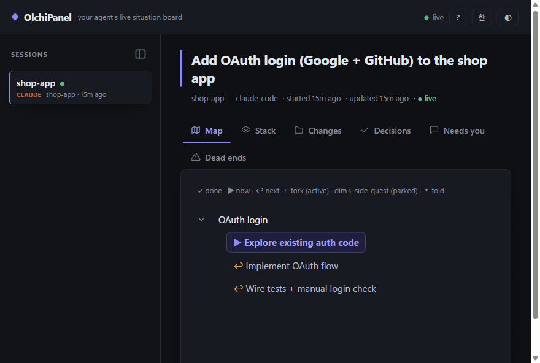

# OlchiPanel

**A living situation board your AI agent draws for you — live.**



Your agent tells you what it's doing in a wall of text you'll never re-read.
OlchiPanel gives it a canvas instead: a pinned goal, a journey map that **actually branches**
when the agent forks into parallel paths, an interrupt stack so nothing you said gets lost,
and decisions/blockers — all updating **live in your browser** while the agent works.

Works with **any MCP-capable agent** — Claude Code, Cursor, Codex CLI, and friends.
No SDK, no build step, **zero dependencies**. One file of config and the panel bakes itself.

## Quick start

One command in your project folder — no install step, `npx` handles it:

**Claude Code**:
```sh
claude mcp add olchipanel -s project -- npx -y olchipanel
```

**Codex CLI**:
```sh
codex mcp add olchipanel -- npx -y olchipanel
```

**Cursor** (no CLI — paste into `.cursor/mcp.json`; Claude Code's `.mcp.json` takes the same shape):
```json
{
  "mcpServers": {
    "olchipanel": { "command": "npx", "args": ["-y", "olchipanel"] }
  }
}
```

The panel's help screen (`?`) also has **Add for me** buttons that write these configs for you.

(Running from a clone instead: `"command": "node", "args": ["<path-to>/bin/olchipanel.js"]`.)

Then add **one line to your agent's rules file** (`CLAUDE.md` / `.cursorrules` / `AGENTS.md`):

> Maintain your OlchiPanel situation board while you work: set_goal when you understand the task, add_step/set_status as you progress, push_interrupt on topic changes.

That line matters: measured head-to-head, agents with only the MCP config finish tasks without touching the board;
with the rules line they bake it unprompted. Two lines total — that's the whole integration.

Then open the panel — as the agent works, its situation appears and updates live.
The port is picked automatically (6711, or the next free one); the actual URL is
written to `~/.olchipanel/viewer.json`.

**Auto-open the window.** `npx olchipanel open` opens the panel in its own
app window — no address bar, shows in the taskbar like a native app (Edge/Chrome;
falls back to a normal tab). If a viewer is already running it reuses it; if the
last one died it starts a fresh one. To have the window pop **automatically when
an agent connects**, add an env flag to the MCP config:

```json
{ "mcpServers": { "olchipanel": {
  "command": "npx", "args": ["-y", "olchipanel"],
  "env": { "OLCHIPANEL_OPEN": "app" }
} } }
```

`OLCHIPANEL_OPEN`: `app` (windowed, default when set) · `tab` (normal browser tab) ·
`0` (never). Left unset in MCP mode, nothing pops — so headless/CI runs stay quiet.

## What the agent gets

Eleven tools, self-explanatory enough that agents use them unprompted:

| tool | what it does |
|---|---|
| `resume_project` | inherit the project's previous panel — goal, journey, decisions, dead ends — as memory; the old panel is archived |
| `name_session` | name this session ("call this one Master") — big in the sidebar |
| `set_goal` | pin the north-star goal at the top |
| `add_step` | grow the journey map; `branch: true` + why-note marks a fork |
| `set_status` | `now` / `next` / `done` / `pause` — live progress, incl. per-branch |
| `push_interrupt` / `pop_interrupt` | topic changed mid-task? the old task + resume point is saved, visibly |
| `log_change` | every file/command/commit touched — read this, not the transcript |
| `add_decision` | decisions made — and silent `assumption`s, surfaced |
| `log_deadend` | tried & failed, with why — nobody walks it twice |
| `need_human` | the agent's inbox to you: questions, approvals, blockers |
| `get_panel` | read back state + viewer URL |

Sessions are auto-grouped by vendor (Claude / Codex / Cursor / Gemini) with color coding —
the agent identifies itself in the MCP handshake, so this needs zero config.

Parallel subagents inherit the tools — each one updates its own branch,
so you watch alternatives develop **side by side, live**.

## Sessions die. The panel doesn't.

Every panel belongs to a **project** (its working directory), not just a session.
When a new agent connects where a previous panel exists, the server tells it up
front, and one `resume_project` call hands over the whole situation — goal,
journey so far, decisions, dead ends, open asks — as an inherited memory the new
agent actually reads. The old panel is archived; the board keeps **one living
panel per project**. This works across vendors: a panel baked by Claude Code can
be inherited by Codex, and vice versa.

Joined mid-task with no previous panel? The instructions tell the agent to
backfill: a panel that starts at step 5 should still show steps 1–4.

## Optional: deterministic Changes via hooks (Claude Code)

The rules line makes agents fill the board unprompted — measured — but it still relies on
model discipline. For the Changes tab you can remove that reliance entirely: a hook logs
every file edit, command, and commit automatically, even when the model forgets.

`.claude/settings.json` in your project:
```json
{
  "hooks": {
    "PostToolUse": [
      { "matcher": "Edit|Write|Bash|NotebookEdit",
        "hooks": [{ "type": "command", "command": "npx -y olchipanel hook" }] }
    ]
  }
}
```

Repeated edits of the same file coalesce; read-only commands are skipped. The MCP core
stays agent-agnostic — hooks are a per-agent enhancer, not a requirement.

## How it works

- One `olchipanel` process per agent (stdio MCP, handrolled JSON-RPC — that's why zero deps).
- State = plain JSON files in `~/.olchipanel/sessions/`. Multiple agents, one board.
- Whichever process gets the port serves the viewer (HTTP + SSE). Port taken → someone already serves. Default port 6711, walks up if reserved; `OLCHIPANEL_PORT` overrides.
- The viewer's sidebar lists every session, labeled by the agent's own `clientInfo.name` — that's how it stays agent-agnostic with zero config.
- If the viewer ever dies (red "reconnecting…" dot), recovery is one command: `npx olchipanel viewer`. The board is stateless — a fresh viewer re-reads everything from disk, and open tabs heal themselves via `EventSource` auto-retry.

## Scope & privacy

OlchiPanel is a **local developer tool**: it runs on your machine, binds only to
`127.0.0.1` (never exposed to the network), sends nothing anywhere, and has **zero
runtime dependencies**. Panel state lives in plain JSON under `~/.olchipanel/` —
readable by anything on your account, so don't have your agent write secrets into
the goal/steps/changes (it shouldn't anyway). Nothing is uploaded, tracked, or shared.

Hardening, because localhost servers deserve it: every request is **Host-checked**
(DNS-rebinding guard), every write endpoint is **Origin-checked** (CSRF guard) and
runs **fixed server-side templates only** — no request ever carries a command, a
path, or config content. And at ~115 kB of dependency-free source, auditing it
yourself is a ten-minute read.

## Status

v0.1 — working vertical slice (MCP server, live viewer, branch-aware journey map). Pre-release.

## License

MIT
